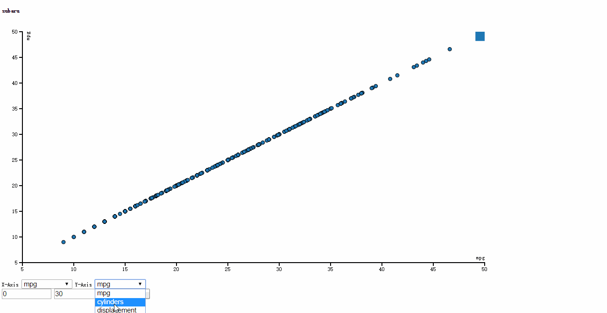

# D3_Lab
lab 10 of Big Data Course
Feature demo

Features

used JS to read the car.csv located on the server

dropdown lists in the UI div for selecting the data dimensions to be plotted as X-axis and Y-axis

after the 'query MPG' button is pressed, updated to render only the cars with MPG in range.

D3 rendering uses	the	enter/exit/update	data mapping.

when the mouse hovers a sctterplot point, the header is updated at the same time
